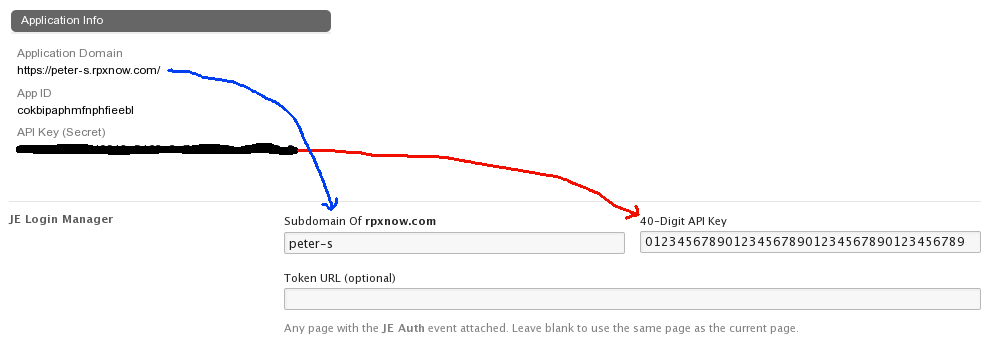

# Janrain Engage Login Manager #

A Symphony CMS extension for embedding the Janrain Engage social login widget on web pages.

## Usage: ##

### Firstly ###
Go to [janrain.com](http://janrain.com), create an account and follow the instuctions on making a login widget.

### Secondly ###
To set up JE Login Manager you need to enter your 40-digit API and your subdomain of **rpxnow.com** on the preferences page (`System -> Preferences`), as shown in the image below:

### Thirdly ###
The data source **JE Login User Info** can be customized by going to `Blueprints -> JE Login Manager`. By default there are three elements: `provider`, `name` and `email`. The information fields available vary from one provider to another; see [https://rpxnow.com/docs/providers](https://rpxnow.com/docs/providers).

### Fourthly ###
Attach the **JE Auth** event to the page or pages that will take POST data during the login process. Add the **JE Login User Info** data source to pages that need it.

To embed the widget on a page, the HTML to use is `

`. The neccessary JavaScript will be inserted into the document head automatically.